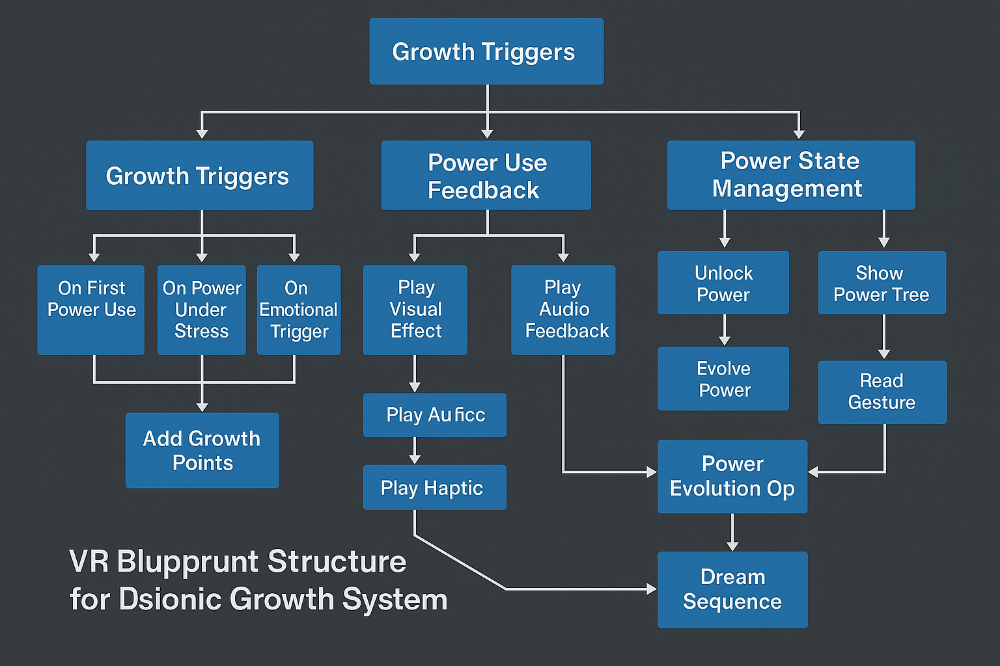

# 4.2 Psionics: Mental & Soul Powers

This deals with **mental or psychic powers** used by characters to affect the world around them. They are typically distinct from magic, often themed around internal mental focus, alien intelligence, or latent human potential. Psionics appear in many RPG systems (e.g., *Dungeons & Dragons*, *GURPS*, *Traveller*, *Dark Sun*, *Starfinder*), each with its own spin.

Here’s a general overview of **common psionic ability categories** across RPG systems, followed by example abilities in each.

---

## 🧠 **Core Categories of Psionic Powers**

1. **Telepathy**
    - Deals with communication and mental influence.
    - **Abilities:**
        - *Mind Link* – Establish mental communication with another being.
        - *Mind Probe* – Read surface or deep thoughts.
        - *Dominate* – Seize control of another's actions.
        - *Empathic Projection* – Project feelings like fear, love, etc.
2. **Telekinesis**
    - Manipulation of matter using the mind.
    - **Abilities:**
        - *Lift/Move Object* – Move objects or creatures at a distance.
        - *Force Field* – Create a mental shield or barrier.
        - *Crush* – Apply intense pressure or force to a target.
        - *Flight* – Propel oneself through the air via thought.
3. **Clairsentience**
    - Psychic perception beyond normal senses.
    - **Abilities:**
        - *Precognition* – See into the future.
        - *Postcognition* – View past events at a location.
        - *Remote Viewing* – Perceive distant places or people.
        - *Psychometry* – Read an object's history via touch.
4. **Psychometabolism** (Biopsionics)
    - Altering one’s own or others’ biology using the mind.
    - **Abilities:**
        - *Body Control* – Shut off pain, slow bleeding, resist poison.
        - *Regeneration* – Heal rapidly.
        - *Metamorphosis* – Change physical features or form.
        - *Adrenal Boost* – Temporarily increase strength or speed.
5. **Psychoportation**
    - Psionic movement through space or dimensions.
    - **Abilities:**
        - *Teleportation* – Instantly move to another location.
        - *Dimensional Shift* – Enter other dimensions or planes.
        - *Phase Shift* – Become intangible or pass through matter.
6. **Metacreativity**
    - Creating matter or constructs from psionic energy.
    - **Abilities:**
        - *Ectoplasmic Constructs* – Summon psychic-created tools or creatures.
        - *Object Creation* – Manifest usable items.
        - *Reality Revision* – Alter aspects of the world (very high-level).
7. **Psychokinesis (broader than Telekinesis in some systems)**
    - A general category of matter and energy manipulation.
    - **Abilities:**
        - *Pyrokinesis* – Control or generate fire.
        - *Cryokinesis* – Generate cold or ice.
        - *Electrokinesis* – Manipulate electricity.
        - *Molecular Agitation* – Cause objects to vibrate destructively.

---

## ⚙️ **System-Specific Variations**

Different RPGs approach psionics with unique mechanics and classifications:

### 🛡️ *Dungeons & Dragons (especially 3.5e and Dark Sun setting)*

- Uses power points (similar to spell slots).
- Categories closely follow the ones above.
- Psions specialize in a discipline (e.g., telepath, kineticist).

### 🪐 *Starfinder / Pathfinder 2e (via third-party content)*

- Often treats psionics as separate from magic, though mechanically similar.

### 🧬 *GURPS Psionics*

- Highly modular, skill-based system.
- Powers grouped by ability, and characters must develop them individually.

### 🚀 *Traveller*

- Psionics is rare and feared.
- Skills include Awareness, Telepathy, Clairvoyance, Telekinesis, Teleportation, and more.

## 🧠 **Psionic Evolution System: "Mind Unbound"**

### 🎯 **Design Goals:**

- Psionic abilities grow only through use, stress, or emotional triggers.
- Powers are latent until awakened.
- Growth feels organic, like a muscle being pushed to new limits.
- Inspired by GURPS, Eclipse Phase, and narrative-first RPGs.

---

## 🔹1. **Psionic Latency & Awakening**

Every psion starts with 1–3 **latent potential abilities** (chosen secretly by GM or with the player). These are undeveloped and cannot be used until *triggered*.

### Triggering Conditions:

- Emotional trauma (e.g., fear, loss, rage)
- First contact with another psion or alien mind
- Near-death experience
- Critical success/failure in related mental or sensory rolls

> 🧠 Example: After barely surviving an assassination attempt, the PC suddenly hears the thoughts of the assassin—triggering Telereceive.
>

---

## 🔹2. **Power Categories (Disciplines)**

Each discipline starts with a **latent score of 0**. You must use a power in that discipline to begin progressing.

| Discipline | Example Powers |
| --- | --- |
| Telepathy | Telesend, Mind Reading, Dominate |
| Telekinesis | Lift, Crush, Shield |
| Clairsentience | Remote Viewing, Aura Reading |
| Psychometabolism | Regeneration, Metamorphosis |
| Psychoportation | Teleport, Blink |
| Metacreativity | Create Construct, Ectoplasmic Blade |

---

## 🔹3. **Using Powers to Grow**

Each time you **successfully use a power**, **under strain**, or **in a novel way**, you gain **Growth Points (GP)**.

### 🧩 Growth Points Table

| Situation | GP Gained |
| --- | --- |
| First successful use of a power | 1 GP |
| Using a power to overcome danger/obstacle | 1–2 GP |
| Critical success or failure | +1 GP |
| Emotional trigger (grief, rage, love) | +1 GP |
| Using a power creatively | +1 GP |

> 💡 Optional Rule: You can only earn GP for a specific power once per session, but can earn GP in multiple disciplines.
>

---

## 🔹4. **Advancement Costs**

Growth Points accumulate **separately for each power**. When enough GP are gathered, a power improves. You can also **spend GP** to **unlock a new power** within the same discipline.

### Power Progression Example:

| Power Level | Description | GP Cost |
| --- | --- | --- |
| Latent | Cannot be used yet | 0 |
| Awakened | Can be used under stress | 1 GP |
| Basic | Reliable, 1/day or with fatigue | 3 GP |
| Skilled | Use freely with minor fatigue | 6 GP |
| Mastery | Use with enhancements (range, duration) | 10 GP |
| Evolves | Unlocks new power or mutation | — |

---

## 🔹5. **New Power Unlocking (Optional Rule)**

When a power reaches **Mastery**, the character may:

- **Mutate the ability** (e.g., *Telesend* gains *empathic resonance*).
- **Unlock a new power** in the same category.
- **Blend powers** (*Telekinesis + Clairsentience* = “psychic mapping”)

The GM may ask the player to describe **how the evolution felt**, encouraging character development.

---

## 🔹6. **Fatigue and Danger**

Using psionic powers is mentally taxing.

| Usage Context | Fatigue/Danger |
| --- | --- |
| Calm, simple use | Minor fatigue |
| Under pressure | Moderate fatigue or Will check |
| Pushing limits | May cause nosebleeds, blackouts, temporary insanity |

This creates tension: you can push for growth, but risk consequences.

## 🎮 **Integrating Psionic Growth Through Use in a Computer Game**

### 🧠 1. **Core System Architecture**

**Each power has:**

- **State**: *Locked*, *Latent*, *Awakened*, *Basic*, *Skilled*, *Mastered*
- **Growth Points (GP)** counter
- **Triggers and logs** for emotional, environmental, and mechanical conditions

### 🎯 Example Data Structure (Simplified)

```json
json
CopyEdit
{
  "Power": "Telepathy",
  "State": "Awakened",
  "GP": 2,
  "LastUsed": "2025-05-11",
  "UsageContext": ["Combat", "Interrogation"],
  "TriggerEvent": "Mind-Meld with Alien"
}

```

---

### 🔄 2. **In-Game Triggers for Growth**

| Event Type | Detected By | GP Award |
| --- | --- | --- |
| Successful power use | Ability check success | +1 |
| Use under stress | Enemy proximity, HP threshold, timer | +1 |
| Creative interaction | Context-sensitive use of power | +1 |
| Emotional moment | Dialogue flags, cutscene choices | +1 |
| Critical success/failure | RNG-based outcome | +1 |

> Example: During a high-stakes stealth mission, the player uses Mind Reading to detect a traitor. The game flags “use under pressure + critical success” → +2 GP to that power.
>

---

### 🧬 3. **Visual/UI Feedback Loop**

- **Psionics Menu**: Tree or grid of powers, with GP bars and visual glow indicating growth.
- **Power Usage Overlay**: Shows fatigue gain, chance of evolution, or instability.
- **Evolution Prompt**: When GP threshold is reached, allow player to pick:
    - Evolve the current power (e.g., boost range, reduce cost)
    - Unlock a new power in the same branch
    - Mutate the power into a hybrid (if cross-discipline logic applies)

---

### ⚡ 4. **Narrative Integration**

- **Cutscenes or Dialog Changes** when latent powers awaken
- NPCs may react to untrained power surges (e.g., “Your nose is bleeding… again.”)
- Powers can be tied to **story arcs**: e.g., empathy-based powers unlock after emotional scenes.

---

### 🧪 5. **AI/NPC Reactions and World Effects**

- **NPCs with psionic senses** can detect awakened players, treat them differently.
- Certain powers might destabilize the environment (e.g., *Cryokinesis* freezes water, *Clairsentience* reveals hidden lore layers).
- Powers can generate **risk**: overuse may trigger enemy interest, paranoia, or health risks (madness mechanics, brain hemorrhage, etc.).

---

### 🎲 6. **Example Use Case: Unity/Unreal Engine**

If you're building in Unity or Unreal:

- Powers can be scriptable objects or behavior trees with associated XP/GP and state variables.
- Triggers can be tied to:
    - Event systems (Unity Events, Blueprint Events)
    - Narrative flag systems (Ink, Yarn Spinner, etc.)
    - Custom AI behavior logic to react to psychic events

---

## ✅ Benefits of Integration

- **Immersive character arc**: Powers evolve with you—not ahead of you.
- **Dynamic replay value**: Players grow differently based on actions and choices.
- **Emotion-mechanics synergy**: Ties narrative design to RPG mechanics (e.g., grief unlocks empathy-based powers).
- **Non-linear progression**: Unlocks powers in the order you *need*, not just *want*.

## 🧠 **VR UI for Psionic Growth Through Use**

### 🔹1. **Diegetic Interfaces** (Integrated into the world)

Instead of menus floating in a void, the player interacts with **in-world objects or interfaces**, like:

- **A glowing neural map or "mind lattice"** hovering in front of them when they meditate or rest.
- **A psychic mirror**, memory orb, or *aura vision mode* that reveals power states.
- **Runes, tattoos, or veins glowing on the hands/arms** when a power is active or evolving.

> 🔮 Example: After using "Telekinesis" in a high-stress moment, your hand glows briefly with a subtle fractal pulse — signaling growth. Later, in your mindspace (safe room), you interact with a 3D skill tree by moving your hands and channeling focus.
>

---

### 🔹2. **Gestural Feedback**

Use **hand gestures** or **gaze direction** to indicate:

- **Power activation** (e.g., pinch-pull to lift objects via TK)
- **Growth readiness** (e.g., your hand trembles subtly or glows when a new evolution is available)
- **Skill inspection** (e.g., stare at a symbol or raise your hand to see detailed info float in space)

> 🧠 Bonus: When powers grow, haptics on controllers could thrum gently with ascending pitch, giving physical feedback to internal growth.
>

---

### 🔹3. **Psionic HUD (Non-intrusive, minimal)**

If some HUD is required, integrate it naturally:

- **Floating glyphs** orbiting the hands or vision periphery, showing current power states.
- A **concentration ring** tightening when focus is high or when powers are about to evolve.
- **Heat map-style visual overlays** in the environment to show emotional or psychic intensity.

> Example: When using Clairsentience, faint spectral outlines of enemies appear through walls. If you just leveled the power, the outlines become crisper, and a soft whisper sound cues the evolution.
>

---

### 🔹4. **In-World Growth Indicators**

Tie progression to environmental and emotional cues:

- **Cracks in reality** appear when a dormant power is near awakening.
- **NPCs react**: “Your energy feels different now… something’s changed.”
- **Mindscape rooms**: An inner sanctum players visit in dreams or meditations, where the psionic tree or neural web grows in 3D.

> This neural web could be an actual VR interface, like a branching coral structure, each node representing a skill. Players walk around it or interact by grabbing and inspecting nodes.
>

---

### 🔹5. **Growth Events & Feedback**

| Event Type | Visual/VR Feedback Example |
| --- | --- |
| First use of a power | Ripple of light from your eyes or hands |
| Power reaches new tier | Floating text (“Mind Reading: Evolved”), subtle audio cue |
| Near evolution | Visual distortion or a “buzz” in the controller |
| Emotional trigger | Time slows briefly, color saturation rises |
| New power unlock | Mindscape explosion of light, new node pulses |

---

### 🔹6. **Evolution Prompt (Optional Interaction)**

When you have enough GP to evolve:

- The game might **enter a short dream or trance sequence**, where the player *chooses a new branch* or *channels their growth* using hand movements or emotional choices.

> 🧬 Example: You enter a translucent sphere of memory, floating in VR. In front of you: 3 potential new evolutions. You reach out, touch one, and the entire sphere pulses as your power is reborn.
>

---

## 🛠️ Tools & Frameworks

If you're building this:

- **Unity (with XR Toolkit)** or **Unreal Engine (with Motion Controller templates)** support the gestures, overlays, and interaction events.
- **Shader-based feedback**: Use post-processing for aura vision, mental fog, or distortion effects tied to power activation or growth.
- **Haptic integration**: Combine with controller feedback for emotional connection.

---

## 🧩 Summary: VR Feedback Loop Pillars

| Element | VR Approach |
| --- | --- |
| Growth Awareness | Diegetic cues, hand glow, audio hum |
| Power Use Feedback | Gestures, controller vibration, environment reaction |
| Power Tree Navigation | Neural map in mindscape or vision |
| Emotion Ties | Slow-mo, color shift, ambient change |
| Power Evolution | Immersive selection scene, visual burst |



Below is a **modular Blueprint-class architecture** you can drop into a new or existing Unreal-Engine VR project (UE 5.3+) to implement the *psionic-growth-through-use* loop.

Keep the pieces loosely coupled so you can extend or swap any part.

---

### 1️⃣ Core Blueprint Classes (+ key variables/functions)

| Class (parent) | Key Variables | Core Functions / Events |
| --- | --- | --- |
| **BP_PsionicPowerComponent** *(Actor Component)* | `PowerName` *(Name)*`State` *(Enum Locked→Mastered)*`GP` *(int, RepNotify)*`Thresholds[6]` *(DataTable row)* | `TryActivate(FContext)` – checks state & fatigue → fires **OnPowerUsed** *(Dispatcher)*`AddGrowth(int Amount)` – updates GP → calls `CheckEvolution()EvolvePower()` – changes *State*, resets GP, Broadcasts **OnPowerEvolved** |
| **BP_PsionicSubsystem** *(GameInstance Subsystem)* | `DisciplineTotals` *(TMap<Enum,int>)* | `RegisterPower(UActorComponent*)RouteGrowth(Power,Amount)` – also drives analytics/save |
| **BPI_PsionicGestures** *(Blueprint Interface)* | `ActivatePower(PowerName)GetActivePower()` |  |
| **BP_VRPawn** *(VRTemplate Pawn)* | `PsionicMgr` *(Array of BP_PsionicPowerComponent)* | Implements **BPI_PsionicGestures**. On gesture input → `ActivatePower` |
| **BP_MindspaceActor** *(Actor with 3-D Widget & Niagra)* | `TargetPawn` | Opens on “Meditate” key; binds to each power’s **OnPowerEvolved** to pulse the node mesh |
| **WBP_MindMap** *(UMG)* | Node widget user controls | Each node binds to power component → shows GP bar & state glow |
| **BP_EvolutionPrompt** *(Widget/3D)* |  | Displays 2-3 evolution options when `OnPowerEvolved` fires; on selection calls `Power->EvolvePower()` |
| **BP_HandFX** *(Actor)* | `MID_HandGlow` *(Material Inst)* | On `OnPowerUsed` → Timeline drives emissive, calls **PlayHapticEffect** on motion controller |

---

### 2️⃣ Blueprint Event Flow (excerpt)

1. **Gesture → Power Use**

    `BP_VRPawn::Input_TKGesture`

    → **BPI_PsionicGestures.ActivatePower("Telekinesis")**

    → `BP_PsionicPowerComponent::TryActivate(FContext = Stress)`

    → **OnPowerUsed** (Dispatcher, passes *Context*)

2. **Growth Points**

    `BP_PsionicSubsystem::RouteGrowth` receives event, adds GP;

    if `GP >= Thresholds[State]` → calls `Power->EvolvePower()`.

3. **UI & FX**

    `BP_HandFX` responds to **OnPowerUsed** ⇒ glow + haptic.

    `BP_MindspaceActor` listens to **OnPowerEvolved** ⇒ pulses node, spawns `BP_EvolutionPrompt` in front of player.


---

### 3️⃣ Replication & Save Tips

- Mark `GP`, `State` as **RepNotify** so multiplayer clients get updates.
- Run `TryActivate` & `AddGrowth` on **Server** (validate), then multicast FX.
- Save `PowerName`, `State`, `GP` per-player in a **SaveGame** object; load into components on `BeginPlay`.

---

### 4️⃣ VR-Friendly UX Practices

- **Diegetic menus**: `BP_MindspaceActor` appears where the player is looking; scale node spacing to avoid motion-sickness head-yaw.
- **Haptics**: short 0.1 s vibration on use; 0.4 s ramp when evolution hits.
- **Audio**: layer subtle ascending pad when GP ≥ 80 % of threshold.
- Use **Niagara ribbon trails** to briefly arc from hand to power node on evolution—reinforces spatial memory.

---

### 5️⃣ Extending the System

- Add a **DataTable** of powers with JSON-like rows: thresholds, fatigue cost, default gestures.
- Drive **Material Parameter Collections** for world post-process (e.g., vignette + chromatic aberration) during heavy psionic strain.
- For hybrid powers, let `BP_PsionicSubsystem` check when *two* disciplines reach *Skilled* → auto-spawn a new latent component.

---

**Drop these Blueprints into a new VR project**, wire your gestures, and you have an experiential psionic growth loop that feels *alive* in VR.

[4.2.1 Overview & Separation from Magic](04_02_01_00_00_00_00__overview-and-separation-from-magic.md)

[4.2.2 Power Source: Mind, Emotion, Will](04_02_02_00_00_00_00__power-source-mind-emotion-will.md)

[4.2.3 Core Psionic Abilities (Telepathy, Psychometry, etc.)](4%202%203%20Core%20Psionic%20Abilities%20(Telepathy,%20Psychomet%20226b227cadd780849f98dd15cf985561.md)

[4.2.4 Sanity & Feedback Mechanics](04_02_04_00_00_00_00__sanity-and-feedback-mechanics.md)

[4.2.5 Psionic Discipline Archetypes](04_02_05_00_00_00_00__psionic-discipline-archetypes.md)

<!-- GDD_CHILD_LINKS_BEGIN -->
## Subdocuments

- [4.2.1 Overview & Separation from Magic](04_02_01_00_00_00_00__overview-and-separation-from-magic.md)
- [4.2.2 Power Source: Mind, Emotion, Will](04_02_02_00_00_00_00__power-source-mind-emotion-will.md)
- [4.2.3 Core Psionic Abilities (Telepathy, Psychometry, etc.)](04_02_03_00_00_00_00__core-psionic-abilities-telepathy-psychometry-etc.md)
- [4.2.4 Sanity & Feedback Mechanics](04_02_04_00_00_00_00__sanity-and-feedback-mechanics.md)
- [4.2.5 Psionic Discipline Archetypes](04_02_05_00_00_00_00__psionic-discipline-archetypes.md)
<!-- GDD_CHILD_LINKS_END -->
