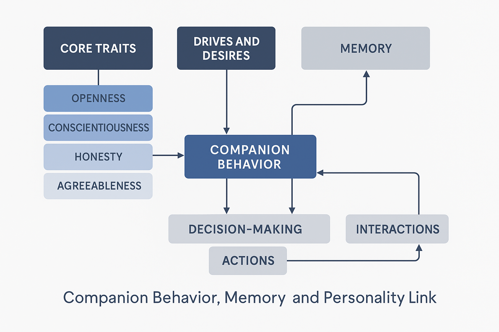
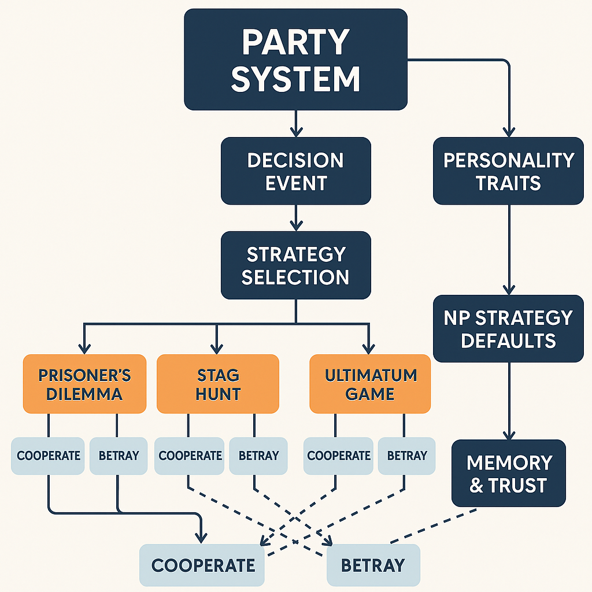

# 9.5 Companion & Social Story Systems

Storylines that arise from relationship simulation and party dynamics.

### 🧠 **Core Concept**

The **Companion AI system** in *Infinite Worlds* aims to simulate autonomous individuals who **think, feel, and act** according to their evolving personalities, memories, and relationships. These NPCs are not scripted followers—they are dynamic agents whose behaviors create **emergent narrative experiences**.

### 1. 🧬 Personality Framework

Each companion (and important NPCs) is generated with a **comprehensive personality profile**, made of layered psychological, moral, and emotional traits.

### 🔹 Big Five or Custom Trait Model:

| Trait | Description |
| --- | --- |
| **Openness** | Creative, curious, and novelty-seeking companions explore more and question tradition. Low openness companions resist change. |
| **Conscientiousness** | Disciplined and reliable NPCs follow plans, while low-conscientiousness ones may act impulsively. |
| **Extraversion** | Influences talkativeness, initiative in group decisions, and reactions to crowded social situations. |
| **Agreeableness** | Empathetic companions support and forgive, while low-agreeableness types may argue or even betray. |
| **Neuroticism** | High-neuroticism NPCs may panic under stress, develop trauma, or require reassurance. Emotionally stable ones become anchors in crisis. |

### 🔹 Moral Alignment & Value System:

Each NPC holds **ethical stances** and **cultural values** that may evolve over time.

- Sample moral axes:
    - Mercy ↔ Vengeance
    - Loyalty ↔ Independence
    - Faith ↔ Skepticism
    - Pragmatism ↔ Idealism

> Example: A pragmatic, low-agreeableness mercenary may tolerate cruelty for survival—until it clashes with their trauma from a past betrayal.
> 

### 2. 🔄 Dynamic Behavior Modeling

### 🧩 Modular Needs System:

Inspired by Maslow’s hierarchy, companions evaluate their environment constantly:

| Need Type | Examples |
| --- | --- |
| **Physiological** | Hunger, fatigue, pain, temperature. A hungry companion may complain, search for food, or refuse travel. |
| **Safety** | Fear of monsters, political persecution, bad weather. A cowardly NPC might refuse to enter a dark crypt. |
| **Social** | Companions develop attachments or rivalries. Two who bond might act together or protect each other in combat. |
| **Esteem** | NPCs may want recognition, to prove themselves, or earn the player's trust. |
| **Self-Actualization** | Unique personal goals that shape the NPC’s arc—e.g., revenge, justice, mastery, or redemption. |

### 🧠 Memory & Opinion System:

NPCs form **memory logs** of:

- What the player did or said.
- What others did (including betrayal, gifts, leadership, decisions).
- Events in the world (a destroyed village, a won battle, a cruel choice).

These memories form an **emotional gradient** that influences current trust, fear, admiration, or resentment toward the player or others.

---

### **3. Autonomy in Action**

- **Independent Decision-Making**:
    - Companions choose how to act in combat, exploration, and social situations.
    - One might scout ahead, another might try to negotiate with enemies instead of attacking.
- **Disagreements & Conflict**:
    - AI companions may argue with each other or with you.
    - You can act as mediator, ignore them, or choose sides—each option carries consequences.
- **Risk Assessment**:
    - Decisions like whether to stay in a fight, flee, use a potion, or save an ally are based on personal risk tolerance, health, and loyalty.

---

### **4. Hidden Agendas & Deception**

- **Secret Motives**:
    - Companions may have covert goals that conflict with yours.
    - Example: A companion is secretly loyal to a rival kingdom and feeds them intel.
- **Lying & Acting**:
    - Companions can *pretend* to be cooperative, manipulate group dynamics, or slowly sabotage the party.
    - AI will use believable social cues, body language, or dialogue to mask true intentions—making detection a gameplay challenge.
- **Discovery Systems**:
    - Players may catch them in lies, overhear suspicious conversations, or notice contradictions.
    - Optional tools: magical truth-seeing, companion diaries, interrogation.

---

### **5. Interaction & Development**

- **Dialogue**:
    - Fully dynamic dialogue system—context-sensitive lines based on mood, memory, and current events.
    - Conversations can be bonding moments or boiling points for conflict.
- **Bonding Events**:
    - Small emergent moments (e.g., helping them bury a lost comrade, celebrating after a tough battle) strengthen trust or reveal backstory.
- **Evolving Relationships**:
    - A companion who begins hating the player might come to respect them—or become an enemy.
    - Loyalty arcs are based on lived experience, not branching trees.

Add influence of player charisma or persuasion stats

---

### **6. Personality-Modulated Utility**

- **Example Interactions Based on Trait Variations**:
    - *Cowardly but Loyal*: Stays by your side but hides during fights.
    - *Charismatic and Selfish*: Helps negotiate, but might hoard treasure.
    - *Empathetic and Curious*: Cares for wounded NPCs and asks questions about lore.



**Maslow's Hierarchy of Needs** (or a modified version) as a foundational framework for NPC behavior is a powerful way to drive **realistic, layered decision-making**.

### 🧠 How It Works in Your Game's AI System

Each NPC, including companions, operates with a **needs stack**, where behavior prioritization depends on which tier of needs is currently unmet. Here's how it can map into your game:

---

### **1. Survival Needs (Physiological)**

- **Food, water, rest, warmth, health**
- Drives:
    - Forage or hunt for food
    - Sleep or avoid combat if exhausted
    - Seek healing or care for wounds
- AI impact:
    - Refuses to follow you into danger when starving
    - May steal supplies or leave if needs aren't met

---

### **2. Safety Needs**

- **Protection, shelter, predictability**
- Drives:
    - Seek safe shelter at night or during storms
    - Avoid high-risk routes or dungeons
    - Be wary of player decisions that risk group stability
- AI impact:
    - Might argue with reckless plans
    - Cowardly types might desert or betray to ensure survival

---

### **3. Social Needs (Belonging & Love)**

- **Friendship, loyalty, respect, bonding**
- Drives:
    - Maintain good relations with other party members
    - Form attachments or rivalries
    - Seek social rituals (campfire chats, celebrations)
- AI impact:
    - Defend friends in battle
    - Sulk or isolate if ignored or mistreated
    - Might betray group loyalty for someone they love

---

### **4. Esteem Needs**

- **Recognition, status, accomplishment**
- Drives:
    - Compete with others, seek praise or leadership
    - Request titles, personal missions, gifts
    - May grow resentful if overshadowed or disrespected
- AI impact:
    - Can challenge your leadership
    - Might leave if treated like a servant
    - Ambitious characters may plot or manipulate others

---

### **5. Self-Actualization**

- **Personal goals, ideals, fulfillment**
- Drives:
    - Seek justice, redemption, knowledge, artistry, vengeance
    - May ask to detour for personal quests
    - Push moral agendas that conflict with party goals
- AI impact:
    - Could refuse actions that betray their beliefs
    - May sacrifice themselves for a cause
    - Can grow and change meaningfully over time

---

### 🎯 Bonus: Dynamic Priority System

- Needs constantly shift based on environment, relationships, and trauma.
- An NPC who normally seeks respect may revert to survival instincts if critically wounded.
- Layered behaviors emerge from overlapping needs (e.g., someone risks their life to save a friend because social and esteem needs override safety).

**Relationship matrix** that dynamically tracks how companions **feel about each other** and about **the player** based on their experiences, personalities, and evolving needs.

---

## 🧩 Relationship Matrix Overview

Each NPC tracks a **trust**, **respect**, and **affinity** score for:

- Every other party member
- The player

### 🔧 Matrix Variables

| Variable | Description |
| --- | --- |
| **Trust** | "I believe they’ll protect or be honest with me" |
| **Respect** | "I admire their skill, leadership, or ideals" |
| **Affinity** | "I like them and enjoy their company" |

These values range from **-100 (hostile)** to **+100 (deep bond)** and change based on **events, decisions, dialogue, and needs**.

---

## 📊 Example Relationship Matrix (Initial State)

| From → To | 🧙 Revain | 🛡️ Boran | 🐺 Enna | 🧝 Serelith | 🧔 Player |
| --- | --- | --- | --- | --- | --- |
| **Revain** | – | +10 R / -5 T / 0 A | +5 R / 0 T / -10 A | +20 R / -20 T / -30 A | +25 R / +15 T / 0 A |
| **Boran** | -10 R / -10 T / -30 A | – | +20 R / 0 T / -10 A | -25 R / -15 T / -20 A | +30 R / +30 T / +10 A |
| **Enna** | -10 R / -30 T / -40 A | +20 R / 0 T / -10 A | – | -5 R / +15 T / +10 A | +15 R / +25 T / +30 A |
| **Serelith** | +25 R / -10 T / +20 A | -30 R / -30 T / -30 A | +5 R / +5 T / +20 A | – | +40 R / +20 T / +30 A |

> Legend:
> 
> 
> R = Respect | T = Trust | A = Affinity
> 

---

### 🎯 Example Events & Relationship Effects

| Event | NPC Affected | Change |
| --- | --- | --- |
| Player defuses conflict peacefully | Serelith | +10 Trust, +10 Respect |
| Boran executes a surrendering enemy | Serelith | -15 Trust, -20 Affinity |
| Revain heals Boran with dark magic | Boran | +20 Trust, -10 Affinity |
| Enna is left behind during retreat | Enna | -30 Trust toward player |
| Player supports Enna over Boran in argument | Enna +20 Trust, Boran -15 Respect |  |

---

## 🔄 Matrix System Behavior

- **When Trust < -50**: NPC may **refuse to share plans** or **warn the player of danger**
- **When Affinity > 70**: NPC may **protect, romance, or follow loyally**
- **When Respect < -30**: NPC may **challenge authority or disobey orders**
- **If all three drop low**: Betrayal, desertion, or sabotage becomes possible

---

## 🛠️ Implementation Ideas

- Track values per NPC → NPC & NPC → Player
- Use a lightweight **event trigger system** to update values:
    - Event = `EnnaAbandonedInBattle`
    - Trigger = `ModifyRelationship(Enna → Player, Trust -= 30)`
- Store memory notes as flavor text (e.g. *“Left me to bleed.”*) to influence future dialogue

**Party Management System (PMS)** that tracks relationships, personalities, needs, memories, and influence between party members and the player *in real time* during gameplay. Below is a structured system overview including **data architecture, gameplay hooks, and UI ideas**.

---

## 🧠 **Party Management System Overview**

### 🔧 Core Components

1. **NPC Personality Engine**
    - Big Five traits (OCEAN: Openness, Conscientiousness, Extraversion, Agreeableness, Neuroticism)
    - Core values (loyalty, justice, power, freedom, etc.)
    - Hidden goals and secrets
    - Dynamic mood states (anger, fear, admiration, etc.)
2. **Relationship Matrix**
    - Tracks **Trust**, **Respect**, **Affinity** for:
        - Each other NPC
        - The player
    - Updates based on events, dialogue, alignment with values, and needs conflicts
3. **Needs Engine**
    - Based on a layered **Maslow-style hierarchy**
        - Survival → Safety → Belonging → Esteem → Fulfillment
    - Needs affect **behavior**, dialogue tone, and **cooperation** levels
4. **Memory Log**
    - Time-stamped events per NPC:
        - ["Abandoned during ambush", “Was healed by Player”, “Witnessed Boran kill prisoner”]
    - Emotional reaction attached: (+trust, -respect, +fear, etc.)
    - Used to shape **behavior prediction and loyalty tracking**
5. **Behavior Controller**
    - NPCs evaluate context constantly:
        - *Is this order aligned with my values?*
        - *Do I trust the player enough to follow this command?*
        - *Does another party member I dislike support this action?*
    - Can result in:
        - Loyalty
        - Disobedience
        - Conflict or betrayal

---

### 🧰 Game Hook Integration (Simplified)

```
plaintext
CopyEdit
EVENT: Player chooses to burn a village.

→ Serelith: -30 Trust, -50 Respect, Memory[“Watched Player destroy peaceful village”]
→ Enna: -10 Trust (for forcing decision), +10 Respect (if it served survival)
→ Revain: +15 Respect (“Power is power.”), +0 Trust
→ Boran: +25 Respect, +10 Trust, considers player “Decisive leader”

```

---

### 📊 UI Component: Party Relationship Dashboard (in-game)

| NPC | Mood | Trust (P) | Affinity (P) | Secret Goal | Recent Memory |
| --- | --- | --- | --- | --- | --- |
| Serelith | Anxious | 35 | 80 | Find sister | “Disapproved of massacre” |
| Boran | Focused | 85 | 60 | Die honorably | “Respected your command” |
| Enna | Distant | 60 | 50 | Stay free | “Stayed silent during fight” |
| Revain | Calm | 70 | 30 | Feed the pact | “Observed your cruelty” |
- Hovering over a value shows **relationship changes and cause**
- Icons indicate **current feelings** (loyalty, fear, distrust)
- Tabs for: `Memories`, `Needs`, `Personality`, `Conflicts`

---

### 🧪 Optional Gameplay Mechanics Tied to PMS

| Mechanic | Description |
| --- | --- |
| **Party Votes** | On major choices, party may vote if trust/respect is low |
| **Secret Actions** | Some NPCs act behind your back (spying, thieving, reporting) |
| **Loyalty Boons** | High loyalty unlocks unique storylines, skills, gear |
| **Mutiny/Betrayal** | NPC may leave or attack if bonds are broken |

---

### ⚙️ Technical Recommendation (For Implementation)

- Use a **Component-Based AI Framework**
    - Each NPC has:
        - `PersonalityComponent`
        - `MemoryComponent`
        - `NeedsComponent`
        - `RelationshipComponent`
        - `BehaviorDecisionComponent`
- Relationships and emotions stored as **weighted variables with decay over time**
    - Old events fade unless re-triggered or reinforced
- Integration with dialogue and quest systems via **dynamic tags**
    
    *(e.g., dialogue lines change based on trust level or recent betrayal)*
    

**Pseudocode system** for tracking and updating **NPC relationship values** over time. This is designed to be **modular**, extensible, and easily integrated into most game engines (Unity, Unreal, Godot, or custom).

---

## 🧩 Core Concepts

Each **NPC** has:

- `RelationshipComponent`: Tracks feelings toward the player and other NPCs.
- `MemoryComponent`: Logs emotional events.
- `PersonalityComponent`: Influences how they interpret events.
- Optional: `NeedsComponent`, `GoalComponent`.

---

## 🧠 Example Pseudocode

```python
python
CopyEdit
class RelationshipComponent:
    def __init__(self, target_id):
        self.target_id = target_id  # Player or other NPC
        self.trust = 50  # Range: 0-100
        self.respect = 50
        self.affinity = 50
        self.memories = []  # List of MemoryEntry

    def modify(self, trust_delta=0, respect_delta=0, affinity_delta=0, reason=""):
        self.trust = clamp(self.trust + trust_delta, 0, 100)
        self.respect = clamp(self.respect + respect_delta, 0, 100)
        self.affinity = clamp(self.affinity + affinity_delta, 0, 100)

        self.memories.append(MemoryEntry(reason, trust_delta, respect_delta, affinity_delta))

class MemoryEntry:
    def __init__(self, description, trust_delta, respect_delta, affinity_delta, timestamp=None):
        self.description = description
        self.trust_delta = trust_delta
        self.respect_delta = respect_delta
        self.affinity_delta = affinity_delta
        self.timestamp = timestamp or get_current_time()
        self.faded = False

    def decay(self):
        # Optional: Memory fades over time unless reinforced
        self.trust_delta *= 0.9
        self.respect_delta *= 0.9
        self.affinity_delta *= 0.9
        if abs(self.trust_delta + self.respect_delta + self.affinity_delta) < 1:
            self.faded = True

class NPC:
    def __init__(self, name):
        self.name = name
        self.relationships = {}  # target_id -> RelationshipComponent
        self.personality = PersonalityComponent()

    def get_relationship(self, target_id):
        if target_id not in self.relationships:
            self.relationships[target_id] = RelationshipComponent(target_id)
        return self.relationships[target_id]

    def react_to_event(self, target_id, event_type, intensity=1.0):
        relation = self.get_relationship(target_id)

        # Modifiers based on personality
        personality_multiplier = self.personality.get_modifier(event_type)

        trust_change, respect_change, affinity_change = EventEffects.get(event_type)
        relation.modify(
            trust_delta=trust_change * intensity * personality_multiplier['trust'],
            respect_delta=respect_change * intensity * personality_multiplier['respect'],
            affinity_delta=affinity_change * intensity * personality_multiplier['affinity'],
            reason=f"Event: {event_type}"
        )

class PersonalityComponent:
    def __init__(self):
        # Values range from 0.0 to 1.0
        self.trust_tendency = 0.5
        self.respect_tendency = 0.5
        self.affinity_tendency = 0.5

    def get_modifier(self, event_type):
        # Modify reaction strength based on personality
        # Could be expanded to use Big Five traits or value alignments
        return {
            'trust': self.trust_tendency,
            'respect': self.respect_tendency,
            'affinity': self.affinity_tendency,
        }

```

---

## 🎯 Sample Event Effect Mapping

```python
python
CopyEdit
EventEffects = {
    "PLAYER_SAVED_LIFE": (trust_change := +30, respect_change := +10, affinity_change := +20),
    "PLAYER_BETRAYED": (-50, -40, -60),
    "FRIENDLY_DIALOGUE": (+5, 0, +10),
    "KILLED_HOSTILE": (+10, +20, 0),
    "DEFIED_NPC_MORALS": (-20, -30, -10),
}

```

---

## 🕹️ Sample Usage in Gameplay

```python
python
CopyEdit
enna = NPC("Enna")
boran = NPC("Boran")

# Player betrays Enna
enna.react_to_event("PLAYER", "PLAYER_BETRAYED", intensity=1.2)

# Boran watches player kill an enemy with honor
boran.react_to_event("PLAYER", "KILLED_HOSTILE")

```

---

## ⏳ Optional: Memory Decay System (Run Periodically)

```python
python
CopyEdit
def decay_all_relationships(npc):
    for relation in npc.relationships.values():
        for memory in relation.memories:
            if not memory.faded:
                memory.decay()

```

---

## 🧪 Extensions You Can Add Later

- Faction-based reputation modifiers
- Shared memories between party members (e.g. gossip system)
- Hidden variables (e.g. suspicion, fear, envy)
- Threshold triggers (e.g. mutiny at Trust < 30 and Respect < 20)

**Working Unreal C++ system** for tracking **NPC relationship values** (trust, respect, affinity), memories, and personality-driven reactions to events.

We'll structure this as modular `UObjects` so it can cleanly plug into your **AIController** or **Character** classes.

---

# 🧱 Unreal C++ Implementation: NPC Relationship System

---

## 🔹 1. RelationshipComponent.h

```cpp
cpp
CopyEdit
#pragma once

#include "CoreMinimal.h"
#include "UObject/NoExportTypes.h"
#include "RelationshipComponent.generated.h"

USTRUCT(BlueprintType)
struct FMemoryEntry
{
    GENERATED_BODY()

    UPROPERTY(BlueprintReadOnly)
    FString Description;

    UPROPERTY(BlueprintReadOnly)
    float TrustDelta;

    UPROPERTY(BlueprintReadOnly)
    float RespectDelta;

    UPROPERTY(BlueprintReadOnly)
    float AffinityDelta;

    UPROPERTY(BlueprintReadOnly)
    float Timestamp;

    FMemoryEntry() {}

    FMemoryEntry(FString InDesc, float InTrust, float InRespect, float InAffinity)
        : Description(InDesc), TrustDelta(InTrust), RespectDelta(InRespect), AffinityDelta(InAffinity), Timestamp(FPlatformTime::Seconds()) {}
};

UCLASS(Blueprintable)
class YOURGAME_API URelationshipComponent : public UObject
{
    GENERATED_BODY()

public:
    UPROPERTY(BlueprintReadOnly)
    FString TargetID;

    UPROPERTY(BlueprintReadOnly)
    float Trust = 50.f;

    UPROPERTY(BlueprintReadOnly)
    float Respect = 50.f;

    UPROPERTY(BlueprintReadOnly)
    float Affinity = 50.f;

    UPROPERTY(BlueprintReadOnly)
    TArray<FMemoryEntry> Memories;

    void Initialize(FString InTargetID);

    void ModifyRelationship(float TrustDelta, float RespectDelta, float AffinityDelta, FString Reason);
};

```

---

## 🔹 2. RelationshipComponent.cpp

```cpp
cpp
CopyEdit
#include "RelationshipComponent.h"

void URelationshipComponent::Initialize(FString InTargetID)
{
    TargetID = InTargetID;
}

void URelationshipComponent::ModifyRelationship(float TrustDelta, float RespectDelta, float AffinityDelta, FString Reason)
{
    Trust = FMath::Clamp(Trust + TrustDelta, 0.f, 100.f);
    Respect = FMath::Clamp(Respect + RespectDelta, 0.f, 100.f);
    Affinity = FMath::Clamp(Affinity + AffinityDelta, 0.f, 100.f);

    FMemoryEntry NewMemory(Reason, TrustDelta, RespectDelta, AffinityDelta);
    Memories.Add(NewMemory);
}

```

---

## 🔹 3. PersonalityComponent.h

```cpp
cpp
CopyEdit
#pragma once

#include "CoreMinimal.h"
#include "UObject/NoExportTypes.h"
#include "PersonalityComponent.generated.h"

USTRUCT(BlueprintType)
struct FPersonalityTraits
{
    GENERATED_BODY()

    UPROPERTY(BlueprintReadWrite)
    float TrustModifier = 1.0f;

    UPROPERTY(BlueprintReadWrite)
    float RespectModifier = 1.0f;

    UPROPERTY(BlueprintReadWrite)
    float AffinityModifier = 1.0f;
};

UCLASS(Blueprintable)
class YOURGAME_API UPersonalityComponent : public UObject
{
    GENERATED_BODY()

public:
    FPersonalityTraits Traits;

    void SetPersonality(float TrustMod, float RespectMod, float AffinityMod);
    FPersonalityTraits GetModifiers() const;
};

```

---

## 🔹 4. PersonalityComponent.cpp

```cpp
cpp
CopyEdit
#include "PersonalityComponent.h"

void UPersonalityComponent::SetPersonality(float TrustMod, float RespectMod, float AffinityMod)
{
    Traits.TrustModifier = TrustMod;
    Traits.RespectModifier = RespectMod;
    Traits.AffinityModifier = AffinityMod;
}

FPersonalityTraits UPersonalityComponent::GetModifiers() const
{
    return Traits;
}

```

---

## 🔹 5. Integrate with NPC Character or Controller

In your NPC class (e.g. `ABaseNPCCharacter`):

```cpp
cpp
CopyEdit
UPROPERTY()
TMap<FString, URelationshipComponent*> Relationships;

UPROPERTY()
UPersonalityComponent* Personality;

void ReactToEvent(FString TargetID, FString EventType, float Intensity)
{
    if (!Relationships.Contains(TargetID))
    {
        URelationshipComponent* NewRelation = NewObject<URelationshipComponent>(this);
        NewRelation->Initialize(TargetID);
        Relationships.Add(TargetID, NewRelation);
    }

    URelationshipComponent* Relation = Relationships[TargetID];

    FPersonalityTraits Mods = Personality->GetModifiers();

    // Sample event handling
    float TrustDelta = 0.f;
    float RespectDelta = 0.f;
    float AffinityDelta = 0.f;

    if (EventType == "PLAYER_SAVED_LIFE")
    {
        TrustDelta = 20.f;
        RespectDelta = 10.f;
        AffinityDelta = 15.f;
    }
    else if (EventType == "PLAYER_BETRAYED")
    {
        TrustDelta = -50.f;
        RespectDelta = -30.f;
        AffinityDelta = -60.f;
    }

    Relation->ModifyRelationship(
        TrustDelta * Intensity * Mods.TrustModifier,
        RespectDelta * Intensity * Mods.RespectModifier,
        AffinityDelta * Intensity * Mods.AffinityModifier,
        FString::Printf(TEXT("Event: %s"), *EventType)
    );
}

```

---

## 🧪 Sample Use in Gameplay

```cpp
cpp
CopyEdit
// Example: Enna reacts to player saving her life
Enna->ReactToEvent("PLAYER", "PLAYER_SAVED_LIFE", 1.2f);

// Example: Boran loses trust in another NPC
Boran->ReactToEvent("Revain", "PLAYER_BETRAYED", 1.0f);

```

---

## 🧰 Editor Blueprint Integration

- You can expose `UPersonalityComponent` and `URelationshipComponent` to Blueprints using `Blueprintable` and `BlueprintReadWrite`.
- Use a **Widget UI** to display the relationship matrix during gameplay or dev debug.
- Add decay logic via `Tick()` or timers to fade memory impact over time.



- **Game theory** is a powerful tool for modeling interactions between NPCs and players (or NPCs and other NPCs), especially when those interactions involve **strategic decision-making**, **trust**, **conflict**, **cooperation**, or **betrayal**.

---

## 🎮 How Game Theory Applies to NPC Interactions

### 1. **Prisoner’s Dilemma (Trust & Betrayal)**

- **Situation:** Two NPCs (or player + NPC) must choose whether to **cooperate** or **betray**.
- **Use case:** Faction negotiation, party member trust under stress.
- **Behavioral modeling:** NPCs weigh outcomes based on previous interactions, reputation, or current incentives.

> Example: An NPC might cooperate with the player if trust is high, but betray if their needs aren't being met or they’re incentivized by a rival faction.
> 

---

### 2. **Stag Hunt (Safety vs Reward)**

- **Situation:** NPCs must choose between a **risky group effort** with higher payoff or **safe individual effort** with lower payoff.
- **Use case:** Group hunting, defending the base, shared crafting projects.
- **Behavioral modeling:** NPCs decide based on group trust, hunger levels, or leadership presence.

---

### 3. **Ultimatum Game (Fairness & Morality)**

- **Situation:** One NPC offers a deal (split of loot/resources), the other can accept or reject.
- **Use case:** Sharing loot, splitting rewards from quests, dividing territory.
- **Behavioral modeling:** NPCs may reject unfair offers even at a cost to themselves if they value fairness or are vindictive.

---

### 4. **Tit-for-Tat Strategy (Memory-based Reciprocity)**

- **Situation:** Ongoing interactions where past behavior influences future cooperation.
- **Use case:** Relationships between long-term companions or rival NPC factions.
- **Behavioral modeling:** NPCs forgive but retaliate proportionally based on memory of past behavior.

---

### 5. **Bayesian Game (Hidden Intentions & Beliefs)**

- **Situation:** One or more NPCs operate with **hidden motives**.
- **Use case:** Saboteur or spy behavior in a party; feigned alliances.
- **Behavioral modeling:** NPCs form and update beliefs about others’ loyalty based on observed behavior.

---

## 🧠 Implementing Game Theory in Your System

You already have:

- **Trust / Respect / Affinity** stats.
- **Memory system** with event logging.
- **Personality traits**.

### You can now add:

| Game Theory Feature | Integration Tip |
| --- | --- |
| Decision matrix | Encode into `ReactToEvent()` with risk/reward weights. |
| Strategy patterns | Assign NPCs default "strategies" (cooperative, opportunistic, retaliatory). |
| Belief modeling | Use `Suspicion` as a hidden variable to track possible betrayal. |
| Payoff matrices | Customize for survival, morale, or needs (based on Maslow’s Hierarchy). |
| Trust reinforcement | Adjust based on shared actions: success/failure, fairness of loot, risk-sharing. |

---

## ✅ Example: Betrayal Decision Logic (Pseudocode)

```cpp
cpp
CopyEdit
bool UNPCBehaviorSystem::ShouldBetray(NPC* Self, NPC* Target)
{
    float Trust = Self->GetRelationship(Target->ID)->Trust;
    float SelfBenefit = EvaluatePayoff(Self, "betray");
    float GroupBenefit = EvaluatePayoff(Self, "cooperate");

    if (Trust < 30.f && SelfBenefit > GroupBenefit)
    {
        if (Self->Personality.Traits.TrustModifier < 0.8f)
            return true; // Opportunistic or untrustworthy
    }

    return false;
}

```

---

## 📊 Example Payoff Matrix (Simplified)

|  | Target Cooperates | Target Betrays |
| --- | --- | --- |
| **You Cooperate** | +10 morale, +10 trust | -20 morale, -40 trust |
| **You Betray** | +30 loot, -10 respect | +5 loot, -20 trust |

---

## 🎯 Final Thoughts

Game theory can drive **emergent storytelling**, **complex AI dynamics**, and **deep player choices**. It's especially powerful when:

- Paired with memory + emotion systems.
- Used for simulating **group dynamics**.
- Supports **adaptive NPC behavior**.
- Concrete betrayal simulation based on **game theory** (specifically, a variation of the **Prisoner's Dilemma** and **Bayesian reasoning**) using simplified C++-like pseudocode. This simulates how an NPC may choose to betray or cooperate with the player (or another NPC) depending on trust, past experiences, payoff evaluations, and personality.

---

## 🎮 Game-Theoretic Betrayal Simulation

### 🧠 Core Concepts Modeled

- **Trust score**
- **Payoff matrix** (benefits of cooperation vs betrayal)
- **Memory-based tit-for-tat**
- **Personality (e.g., loyalty, greed, guilt sensitivity)**
- **Randomness for uncertainty**

---

### 🧱 Pseudocode (C++-like)

// Assume a character has a `TrustMap`, `Personality`, and `Memory` of others.

```cpp
cpp
CopyEdit
enum class EStrategy { Cooperate, Betray };

struct PersonalityTraits {
    float Loyalty;     // 0-1
    float Greed;       // 0-1
    float GuiltAversion; // 0-1
};

struct Relationship {
    float Trust;       // 0 to 100
    int CooperativeActs;
    int BetrayalActs;
};

struct Payoff {
    float RewardForBetrayal;
    float RewardForCooperation;
    float PenaltyForBetrayal;
    float RiskOfRetaliation;
};

class NPC {
public:
    TMap<FString, Relationship> TrustMap;
    PersonalityTraits Personality;

    EStrategy DecideStrategy(FString TargetID, Payoff payoff) {
        Relationship rel = TrustMap[TargetID];

        // BASE STRATEGY EVALUATION
        float CooperationScore = rel.Trust * Personality.Loyalty + payoff.RewardForCooperation;
        float BetrayalScore =
              (100 - rel.Trust) * Personality.Greed +
              payoff.RewardForBetrayal -
              Personality.GuiltAversion * payoff.PenaltyForBetrayal -
              payoff.RiskOfRetaliation;

        // Add memory influence
        if (rel.CooperativeActs > rel.BetrayalActs)
            CooperationScore += 10;
        else
            BetrayalScore += 10;

        // Add uncertainty/random behavior
        float randomness = FMath::FRandRange(-5.f, 5.f);
        CooperationScore += randomness;

        return (BetrayalScore > CooperationScore) ? EStrategy::Betray : EStrategy::Cooperate;
    }
};

```

---

### 📊 Example Scenario

```cpp
cpp
CopyEdit
NPC Boran;
Boran.Personality = {0.7f, 0.4f, 0.6f}; // loyal, low greed, moderate guilt

// Player has helped Boran in the past
Boran.TrustMap["Player"] = {75.0f, 3, 0};

Payoff payoff = {
    .RewardForBetrayal = 40.0f,
    .RewardForCooperation = 25.0f,
    .PenaltyForBetrayal = 50.0f,
    .RiskOfRetaliation = 20.0f
};

EStrategy decision = Boran.DecideStrategy("Player", payoff);

if (decision == EStrategy::Cooperate)
    Print("Boran decides to stay loyal.");
else
    Print("Boran betrays the player!");

```

---

## ✅ What This Simulates

- A **trust-based betrayal model** affected by:
    - Personality traits
    - Relationship history
    - Relative payoffs
    - Game uncertainty
- **Emergent behavior**: Even loyal NPCs might betray if trust falls too low or incentives are too high.
- Integrate the **game-theoretic betrayal decision model** into **Unreal Engine's Behavior Tree (BT)** using a combination of:
    - **Behavior Tree Task Node** (`UBTTaskNode`)
    - **Blackboard Variables**
    - **Custom C++ logic for decision-making**

This integration will allow NPCs to **decide between betrayal and cooperation** dynamically during gameplay based on personality, trust, and memory.

---

## 🧱 Step-by-Step Breakdown

---

### 🎯 Step 1: Blackboard Setup

Add these keys to your `Blackboard`:

| Key Name | Type | Purpose |
| --- | --- | --- |
| TargetActor | Object | The NPC or player under consideration |
| ShouldBetray | Bool | Output from decision logic |
| TrustValue | Float | Trust level toward `TargetActor` |

---

### 🧠 Step 2: Custom Task Node (C++)

Create a task node to evaluate whether the NPC should betray or cooperate:

### File: `BTTask_EvaluateBetrayalDecision.h`

```cpp
cpp
CopyEdit
#pragma once

#include "CoreMinimal.h"
#include "BehaviorTree/BTTaskNode.h"
#include "BTTask_EvaluateBetrayalDecision.generated.h"

UCLASS()
class YOURGAME_API UBTTask_EvaluateBetrayalDecision : public UBTTaskNode
{
    GENERATED_BODY()

public:
    UBTTask_EvaluateBetrayalDecision();

protected:
    virtual EBTNodeResult::Type ExecuteTask(UBehaviorTreeComponent& OwnerComp, uint8* NodeMemory) override;
};

```

---

### File: `BTTask_EvaluateBetrayalDecision.cpp`

```cpp
cpp
CopyEdit
#include "BTTask_EvaluateBetrayalDecision.h"
#include "BehaviorTree/BlackboardComponent.h"
#include "AIController.h"
#include "NPCCharacter.h" // Your custom NPC class
#include "GameFramework/Actor.h"

UBTTask_EvaluateBetrayalDecision::UBTTask_EvaluateBetrayalDecision()
{
    NodeName = "Evaluate Betrayal Decision";
}

EBTNodeResult::Type UBTTask_EvaluateBetrayalDecision::ExecuteTask(UBehaviorTreeComponent& OwnerComp, uint8* NodeMemory)
{
    AAIController* AICon = OwnerComp.GetAIOwner();
    ANPCCharacter* NPC = Cast<ANPCCharacter>(AICon->GetPawn());
    UBlackboardComponent* Blackboard = OwnerComp.GetBlackboardComponent();

    AActor* Target = Cast<AActor>(Blackboard->GetValueAsObject("TargetActor"));
    float Trust = Blackboard->GetValueAsFloat("TrustValue");

    if (!NPC || !Target) return EBTNodeResult::Failed;

    // Sample payoff and personality (could be from data tables)
    float Loyalty = NPC->GetLoyalty();
    float Greed = NPC->GetGreed();
    float GuiltAversion = NPC->GetGuiltAversion();

    float RewardBetrayal = 40.0f;
    float RewardCoop = 25.0f;
    float PenaltyBetrayal = 50.0f;
    float RiskRetaliation = 20.0f;

    float CooperationScore = Trust * Loyalty + RewardCoop;
    float BetrayalScore =
        (100.0f - Trust) * Greed +
        RewardBetrayal -
        GuiltAversion * PenaltyBetrayal -
        RiskRetaliation;

    float Randomness = FMath::FRandRange(-5.0f, 5.0f);
    CooperationScore += Randomness;

    bool bShouldBetray = BetrayalScore > CooperationScore;
    Blackboard->SetValueAsBool("ShouldBetray", bShouldBetray);

    return EBTNodeResult::Succeeded;
}

```

---

### 🧩 Step 3: Behavior Tree Graph

Now build a behavior tree that uses this logic:

1. **Selector**
    - **Task: Evaluate Betrayal Decision**
    - **Decorator: Blackboard `ShouldBetray == true`**
        - → Action: "Backstab", "Steal", "Sabotage"
    - **Else**
        - → Action: "Support Ally", "Trade", "Fight Together"

---

### 🧪 Step 4: Testing in the Game World

In `BeginPlay()` or on relationship events:

- Update `TrustValue` in the blackboard.
- Call behavior tree to reevaluate decisions when needed.
- Use visual debugging (`ShowDebug BehaviorTree`) to view decision-making in real time.

---

## ✅ Features This Supports

- Game-theoretic NPC decisions in runtime.
- Personality-driven betrayals.
- Replayable and emergent AI behaviors.

[9.5.1 Companion Quests & Reflections](09_05_01_00_00_00_00__companion-quests-and-reflections.md)

[9.5.2 Dialogue-Informed Memories](09_05_02_00_00_00_00__dialogue-informed-memories.md)

[9.5.3 Campfire, Dream & Conflict Events](09_05_03_00_00_00_00__campfire-dream-and-conflict-events.md)